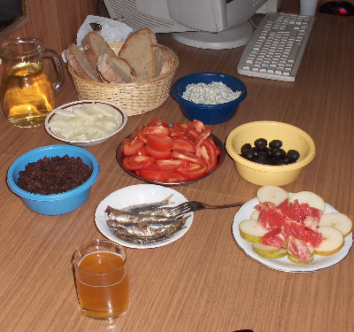

~~~~
Everything below is block code - just delete four preceeding ~ and all text will be markdown formatted.  
Add four ~ again and everything will be displayes as it is written.

# Heading

## Sub-heading

Paragraphs are separated by a blank line.

Two spaces at the end of a line  
produces a line break.

_italic_, **bold**, `monospace`.

Horizontal rule:
---
***


Bullet list:
* lists  
  can have multiple  
  paragraphs
* oranges
* pears
  
Numbered list:
  1. wash
  2. rinse
  3. repeat

Nested list:
* Abacus
* absolute
* Bananas
   1. bitter
   1. bupkis
   3. burper
* Cunning
  
  
A [link](http://example.com).



> Markdown uses email-style > characters for blockquoting.

Inline <abbr title="abbreviations">abr</abbr> are supported.

    Table:
    | Syntax | Description |
    | ----------- | ----------- |
    | Header | Title |
    | Paragraph | Text |
  
    Here's a sentence with a footnote.[^1]

    [^1]: This is the footnote.

~~strikethrough~~

This is <sup>superscript</sup>

This is <sub>subscript</sub>

`<code>` spans are delimited by backticks (AltGr+7). You can include literal backticks like `` `this` ``

Text can be formatted in many <span style="color:yellow">colors</span>, <span style="font-size:2em;">sizes</span> and <span style="font-family:Impact"> fonts</span>.

```{vb}
console.writeline("hello world")
```

`This is code  
and it can be  
like this`

This is `ineline` code

this is Syntax highlighting
```css
#button {
    border: none;
}
.sometext{font-family: Courier; margin: 0 auto}
```

odličan primjer web stranice napisane u markdownu:  
`kod` je na: https://daringfireball.net/projects/markdown/syntax.text  
`HTML` je na: https://daringfireball.net/projects/markdown/syntax


